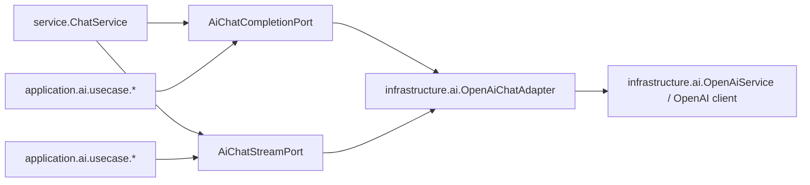

# Architecture (FSD + DDD + Clean AI Boundary)

## Goal
- Preserve existing behavior (API/UX/DB semantics unchanged) while enforcing architectural boundaries.
- Keep frontend dependencies aligned to FSD.
- Keep backend AI integration behind ports/adapters.

---

## Frontend Structure (`apps/web/src`)

### Layer dependency rules

| Layer | Allowed dependencies |
| --- | --- |
| `app` | `widgets`, `features`, `entities`, `shared` |
| `widgets` | `features`, `entities`, `shared` |
| `features` | `entities`, `shared` |
| `entities` | `shared` |
| `shared` | `shared` |

### Feature internal structure
- `model/application`: usecases, orchestration entry points
- `model/domain`: pure rules/selectors/policies
- `model/infrastructure`: gateways/adapters to `shared/api` or browser APIs
- `ui`: rendering and interaction components

### Enforced examples
- `features/interview-session/model/application/interviewSessionUseCases.ts`
- `features/interview-session/model/infrastructure/interviewSessionGateway.ts`
- `features/interview-session/model/infrastructure/interviewerSpeechGateway.ts`
- `features/interview/start-session/model/application/startInterviewSessionUseCase.ts`
- `features/interview-report/model/application/fetchInterviewReportUseCase.ts`

### Widgets composition-only rule
- Widgets assemble screens and pass props.
- State orchestration for interview shell is exposed from feature application:
  - `features/interview-session/model/application/useInterviewShellState.ts`
- Widgets import that application hook instead of owning orchestration logic.

---

## Backend Structure (`server/src/main/java/com/interviewmate`)

### Domain/application/infrastructure split
- `application/.../usecase`: orchestration units
- `application/.../port`: outbound contracts
- `application/.../policy`: pure domain-ish decision logic
- `infrastructure/...`: concrete adapters and external client integration
- `service/...`: facade-like entry layer for existing controller compatibility

### AI boundary

- Application/service layers do not depend directly on OpenAI implementation classes.
- OpenAI-specific details stay in infrastructure adapters/services.

---

## Forbidden dependency examples

### Frontend
- `shared/* -> features/*` (forbidden)
- `entities/* -> widgets/*` (forbidden)
- `features/* -> app/*` (forbidden)
- `widgets/* -> app/*` (forbidden)

### Backend
- `service..` package directly importing `infrastructure.ai.OpenAiService` (forbidden)
- `application.ai.usecase..` depending on infrastructure package classes (forbidden)

---

## Guardrails and CI

### Frontend
- ESLint boundary rules in:
  - `apps/web/.eslintrc.json`
- CI runs web lint + build:
  - `.github/workflows/ci.yml`

### Backend
- ArchUnit dependency checks:
  - `server/src/test/java/com/interviewmate/architecture/ArchitectureDependencyTest.java`
- CI runs server tests (includes ArchUnit):
  - `.github/workflows/ci.yml`

---

## Migration policy
- Apply structural changes without changing public HTTP contracts.
- Move direct external calls into `model/infrastructure` gateways.
- Consume gateways only via `model/application` usecases.
